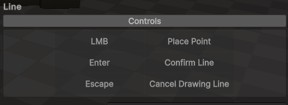

# PrefabPalette: Developers

---
## See Also
* [ReadMe](./README.md)
* [ContributionsGuide](./ContributionsGuide.md)
---
## Overview

This document outlines the architecture of the project.

## Editor Folder Structure
* **Generated:** For all objects generated by the tool.

* **Resources:** For all shared resources like icons and images.

* **Scripts:** Contains all the scripts for the tool.  
  * **Main Windows:** For editor windows opened via the Unity Editor’s `Window` toolbar option.

  * **Overlays:** Scripts for the scene view overlay panel.

  * **Placement Modes:** This is where the logic and settings for placement modes should be stored. Refer to the *Creating New Modes* section for more detailed guidance.

  * **Prefab Collections:** For logic related to creating and managing prefab collections.

  * **Utilities:** For helper and core utility scripts.

## Modes

The modes system is a finite state machine (FSM), making it straightforward to define and transition between new modes.

### Class Diagram

### Creating New Mode
This section explains how to define and integrate new modes into the system.

1\. **Create a new C\# script for the modes logic.**  
In the project window, create an empty C\# script in the *`PrefabPalette > Editor > Scripts > PlacementModes > Modes`* folder.

2\. **Inherit from IPlacementMode**  
Open the script and ensure the class is within the `PrefabPalette` namespace.

The class should iInherit from `IPlacementMode` and implement the following contract:

| **Lifecycle Methods** | |
| :---- | :---- |
| **public void OnEnter(ToolContext)** | Called when the mode is first selected from the overlay. |
| **public void OnActive(ToolContext)** | Called while the mode is active, similar to Unity’s update method. |
| **public void OnExit(ToolContext)** | Called when transitioning away from this mode to a new one. |

|**UI**||
| :---- | :---- |
|  **public string[] ControlsHelpBox { get; }** | Populates the *Controls Dropdown* on the overlay, providing an overview of the mode's controls.  The content is rendered as a 2-column table.  For example:  `public string[] ControlsHelpBox => new string[] { “LMB”, “Place Point”, “Enter”, “Confirm Line”, "Escape", "Cancel Drawing Line" };`  Renders as: |
| **public void SettingsOverlayGUI(ToolContext)** | Renders mode specific ui content below the *Controls Dropdown* on the overlay. |

3\. **Create new mode settings object**

* In the project window, navigate to *`PrefabPalette > Editor > Scripts > PlacementModes > Settings`* folder and create an empty C\# script called (NAME)ModeSettings. Replace (NAME) with the same name given to the mode script.

* Ensure the class is inside the `PrefabPalette` namespace, and inherits from `PlacementModeSettings`.

* In the mode script, create a new private instance field for its settings object.  
  Then, create a constructor that takes `PlacementModeSettings` as a parameter, and cast it the mode specific settings type.

4\. **Add new mode to Placement Mode Manager**
To integrate the new mode into the system, the mode needs to be registered with the `PlacementModeManager`, where the settings object is is assigned at the same time.   

* Navigate to *`PrefabPalette > Editor > Scripts > PlacementModes > PlacementModeManager.cs`* and open the script.

* Add the modes name to the *`ModeName`* enum.
      
      ...

      public enum ModeName
      {
        Single,
        Line,
        ExampleMode
      }

      ...

* In the `InitialiseToolbarButtons` method, Add the new modes icon to the array. 

      ...

      private static void InitialiseToolbarButtons()
      {
        // Add buttons to the toolbar here:
        // NOTE: ModeName enum and toolbarButtons must be in the same order.
        toolbarButtons = new GUIContent[]
        {
          new GUIContent(EditorGUIUtility.IconContent("d_MoveTool").image, "Single Mode"),
          new GUIContent(Resources.Load<Texture2D>("Imgs/LineIcon"), "Line Mode"),
          new GUIContent(Resources.Load<Texture2D>("Imgs/NewModeExampleIcon", "Example Mode)) // New Mode Icon
        };
      }

      ...

* Register the new mode in the `modes` dictionary and create a new instance using the `CreateModeInstance` method.

        ...

        private static void InitialisePlacementModes()
        {
          // Hook up the modes class with the mode enum:
          modes = new Dictionary<ModeName, IPlacementMode>()
          {
            { ModeName.Line, CreateModeInstance<LineModeSettings, LineDrawMode>("LineModeSettings.asset") },
            { ModeName.Single, CreateModeInstance<SingleModeSettings, SinglePrefabMode>("SingleModeSettings.asset") },
            { ModeName.ExampleMode, CreateModeInstance<ExampleModeSettings, ExampleMode>("ExampleModeSettings.asset") }, // New Mode Instance
          };
        }

        ...

### Script Example Templates
#### Mode
    namespace PrefabPalette
    {
      public class ExampleMode : IPlacementMode
      {
        // Reference to the mode's settings.
        ExampleModeSettings modeSettings;

        /// 

        /// Initializes the placement mode with its settings.
        /// 

        public ExampleMode(PlacementModeSettings modeSettings)
        {
          // Cast PlacementModeSettings to ExampleModeSettings.
          this.modeSettings = (ExampleModeSettings)modeSettings;
        }

        /// 

        /// Defines the control instructions displayed to the user.
        /// 

        public string[] ControlsHelpBox => new string[] { };

        /// 

        /// Called continuously while the mode is active and the Scene View updates.
        /// Use for drawing gizmos, handles, and handling interactive events.
        /// 

        public void OnActive(ToolContext context)
        {
          // Implement interactive logic and Scene View drawing here...
        }

        /// 

        /// Called once when the mode is initially activated.
        /// Use for setup operations.
        /// 

        public void OnEnter(ToolContext context)
        {
          // Perform setup tasks...
        }

        /// 

        /// Called once when the mode is deactivated or switched away from.
        /// Use for cleanup operations.
        /// 

        public void OnExit(ToolContext context)
        {
          // Perform cleanup tasks...
        }

        /// 

        /// Renders custom GUI for mode-specific settings in the overlay panel.
        /// 

        public void SettingsOverlayGUI(ToolContext context)
        {
          // Draw mode settings UI elements...
        }
      }
    }

#### Mode Settings
    namespace PrefabPalette
    {
        public class ExampleModeSettings : PlacementModeSettings
        {
          // Mode specific settings...
        }
    }

### Troubleshooting

* **Invalid Operation Exception**
Ensure the modes constructor accepts a single `PlacementModeSetting` as a parameter and it is cast to the expected type.

---

## Prefab Collections System
### Collection Asset
The collection assets are scriptable objects stored in the `Generated/Collections` folder after creation. Scripts can access the current collection asset via the `Settings.CurrentPrefabCollection` property of the `ToolContext` class, where the collections asset is either read from the folder, or created if it doesn't already exist. Collections are deleted from the folder if they are removed from the `PrefabCollectionList`. 

### Enum Generation
The contents of the `Generated/Collections` folder is represented by the `CollectionsName` enum. An enum is used instead of strings to improve the user experience: It enables dropdowns in the editor for selecting collections, prevents manual manual typing errors and ensures only valid options are available. 

Since C# enums are immutable, it must be regenerated whenever the list of collections changes. This is handled by `PrefabCollectionList.GenerateEnum()`, which writes a `CollectionName.cs` enum file to the `Editor/Generated` folder. 

⚠️ Note: Unity recompile's scripts after the enum is generated.

### Collection Manager Window
New collections can be created directly from the collections manager window, however, this means the collection must be populated using the `PrefabCollectionInspector` window.

### Create Collection From Folder
A new `Prefab Collection` can be created with a right-click menu item in the project window. A dialog window in the editor lets the user enter a unique name for the new collection, which triggers the enum file to be rewritten, followed by the editor recompiling scripts. `EditorPrefs` is used to store the prefab paths during recompilation, where they are recovered during creation of the prefab collection asset.

⚠️ Note: Unity recompiles scripts after the enum is regenerated, triggering a domain reload. This is why state is persisted using EditorPrefs.

#### Sequence

#### Class Diagram

---

## Help and Support

If you need any help or have any questions, feel free to open a new issue on the repos issues page or send an email to reach@frayedfunction.com

---
