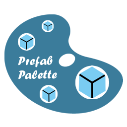
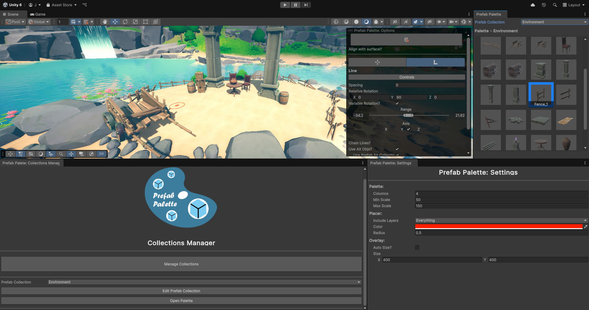
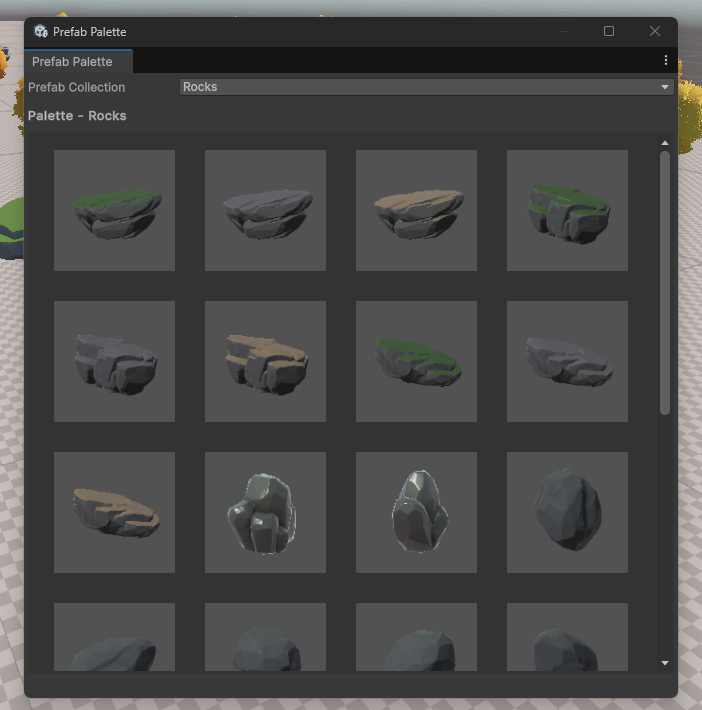
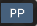
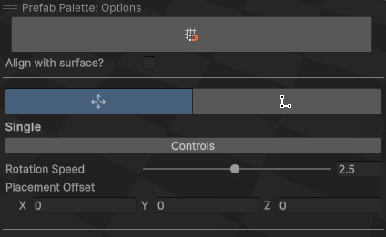
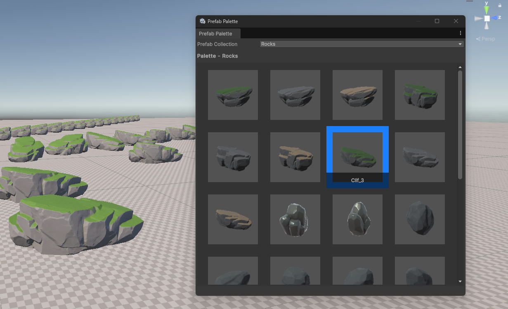

# Prefab Palette: Read Me
---
## See Also
* [Developers](./Developers.md)
* [ContributionsGuide](./ContributionsGuide.md) 
---

## **Overview**

**Description:**  
*Prefab Palette is a self contained Unity Editor tool designed to simplify prefab placement in your scenes. Tired of manually dragging and dropping prefabs into the scene, I built this tool that lets you organise prefabs into collections, choose between different placement modes, and just click in the Scene View to place them.*

⚠️ Note: No prefabs are included with this project! Example assets are from [Raygeas: Grasslands - Stylized Nature](https://assetstore.unity.com/packages/3d/environments/fantasy/grasslands-stylized-nature-287353).

**Unity Compatibility:** Unity 2021.2+

---

## **Core Features**

* *Prefab Collections*:  
  Organise your prefabs into custom collections using the Collections Manager window, or even faster by selecting assets and folders in the Project Window and using the create collection option from the right-click context menu.

* *Palette Window*:  
  Dockable window to browse prefab collections and select prefabs via their thumbnails.

* *Scene View Overlay:*  
  Overlay UI for changing global placement settings, switching Placement Modes and customising their settings directly in the Scene View.

* *Visual Placer:*  
  When the tool is active, a target reticle will appear in the scene view, following your mouse to show where the prefab will be placed based on the current mode and settings.

* *Placement Modes:*  
  Swap between unique placement behaviors with their own set of options, all in the scene view overlay.

* *Configurable:*  
  Customise tool-wide settings in the Tool Settings window. Adjust the palettes’ scale, overlay size, placer colour, placer physics layer and more.

* *Undo/Redo Integration:*  
  Instantiated prefabs are integrated into Unitys native Undo/Redo system. 

* *Extendable:*  
  Built with a modular, state-based design, making it easy to add new placement modes. see [Developers.md](./Developers.md) for detailed guidance.

---

## **Installation**

1. Download the latest package from the **Releases** section of the repo.

2. Drag and drop the package into the project window of a unity project.

3. Follow the dialog to import package contents.

4. The prefab palette folder is self-contained, so it can be moved anywhere within the project without breaking, providing its internal integrity is maintained.

---

## **Quick Start**
Follow this guide to start using the tool straight away.

### **Create a Collection**
1. In the project view, navigate to your prefab folder/s.  
2. Right click on the folder or selected prefab/s you want in the collection.  
3. Select `Create Prefab Collection` from the context menu.  
4. Enter a name for your collection in the dialog box.  
5. Press Create.  
6. After the domain reload, a dialog box will confirm collection creation.

### **Open the Palette**

The palette can be opened through either:
1. The options overlay.
2. Unity Editor Toolbar: `Window > Prefab Palette > Palette`

### Choose Mode
1. Open the tools overlay by either:
 * between Unity version **2021.2** & **2022.3**: Overlays are hidden by default. Use the *backtick* key to open the overlay menu, and choose `Prefab Palette: Options` from the list.
 * Unity version **2023.1+**: Open with the overlay toolbar icon  

2. Choose the desired mode and settings from the Options Overlay in the scene view:  
    

### **Start Placing Prefabs**
1. Select the collection from the enum dropdown at the top of the palette window:  
2. Select a prefab by clicking its thumbnail:  
      
3. A target reticle will appear in the scene view and follow the mouse.  
4. Click to place a prefab in the scene.  

---

## **Overlay** 
The overlay is used to toggle common settings, switch between modes, and adjust mode specific options all from the scene view. Its size can be customised via the tool settings window, see section 6 for more info.  

### How to open
Unity Version:
 * **2021.2** <--> **2022.3**: Overlays are hidden by default. Use the *backtick* key to open the overlay menu, and choose `Prefab Palette: Options` from the list.
 * **2023.1+**: Open with the overlay toolbar icon  

### Resizing the overlay
See the *Overlay* options in the [Tool Settings & Customisation](#ToolSettings&Customisation) section.

---

## **Modes**
### **Global Mode Options**
These options are available across all placement modes.

| *Option* | *Effect* |
| :---- | :---- |
|  **Snapping** | Toggle snap to grid, use native grid system toolbar for dimensions. |
| **Align with surface?** | Align the prefabs rotation with the normal of the surface it’s placed on. |
### **Single**
Click to place a single selected prefab instance.

**Overlay Options**
| *Option* | *Type* | *Effect* |
| :---- | :---- | :---- |
| **Rotation Speed** | Slider | Changes how fast the object rotates. |
| **Placement Offset** | Vector 3 Field | Positions the object with an offset relative to the click position. |
| **Align With Surface?** | Toggle | Rotates the object to match the angle (normal) of the surface clicked on. |

### **Line**
Use this mode to draw a line of prefabs and control how the line renders with the overlay options. Useful for fences and walls etc. 

**Overlay Options**
| *Option* | *Type* | *Effect* |
| ----- | :---- | :---- |
|  **Spacing** |  Float Field | Sets the distance between each placed prefab along the line. |
|  **Relative Rotation** |  Vector 3 Field | Rotates each prefab relative to the line's direction. |
|  **Variable Rotation?** |  Toggle | Applies random rotation to each prefab for more organic placement. |
| **Range**  | Min/Max Slider | Defines the constrained range of rotation per axis. |
| **Axis** | Vector 3 Toggle | Enables/disables random rotation per axis. |
| **Chain Lines?** | Toggle | Starts the next line from the end of the previous one, allowing continuous placement. |
| **Link Offset** | Vector 3 Field | Adds an offset to the start position of the chained line relative to the previous line's endpoint. |
| **Use Alt Objs?** | Toggle | Should other objects be placed along the line? |
| **Use Alt Prefab Collection?** | Toggle | If enabled, alt object is selected randomly from the alternative collection dropdown.  |
| **Alt Object** | Game Object Field  OR Enum dropdown | If **Use Alt Prefab Collection** is enabled, choose the collection from the dropdown.Otherwise, this field takes a prefab to be used as the alt object. |
| **Random?** | Toggle | Should the alt obj be placed randomly by probability? |
| **Probability / Interval** | Float slider Or  Int Field | Probability slider from 0 to 1 if **Random** is enabled. Otherwise this field is an int for fixed intervals. |

---

## **Tool Settings & Customisation**

Settings window can be opened via `Window > Prefab Palette > Settings`

**Palette**
| *Option* | *Effect* |
| :---- | :---- |
| **Columns** | Total number of columns. |
| **Min Scale** | Min size of prefab thumbnails. |
| **Max Scale** | Max size of prefab thumbnails |

**Visual placer**
| *Option* | *Effect* |
| :---- | :---- |
| **Include Layers** | Physics layers that should be included in the placement raycast. |
| **Color** | Set the reticle's colour. |
| **Radius** | The size of the placer reticle. |

**Overlay**
| *Option* | *Effect* |
| :---- | :---- |
| **Auto Size?** | If true, will auto scale the overlay window to fit its contents with no scrolling. |
| **Size** | Set a fixed width (x) and height (y) for the overlay. Scroll to reach cropped content.  |

---
## **Support the Project**   
If you find the tool useful and want to support its development, donations are welcome!

---

## **License**
See [License](./License.md) file for terms of use, redistribution, & modification etc.

---

## **FAQ**
**Q: Can't find overlay?**  
 A: Make sure the tool is imported correctly by ensuring the  `Window` toolbar menu has an option for `Prefab Palette`.
 If you're using Unity version: 
 
 * between **2021.2** & **2022.3**: Overlays are hidden by default. Use the *backtick* key to open the overlay menu, and choose `Prefab Palette: Options` from the list.

 * **2023.1+**: Open with the overlay toolbar icon  

**Q: The tool doesn't show up in the Unity `Window` toolbar menu?**  
 A: Make sure the tool is imported from the Unity Package correctly, all scripts are present, and you’re using a compatible Unity version.

**Q: Objects aren’t placed correctly?**  
 A: Check if your prefab has a root transform offset or collider.

 **Q: Objects are glitching or stacking as they're being placed?**  
 A: Check `ToolSettings > Placer > Include Layers` and deselect the physics layer your prefab is on. 

**Q: Can I use this with terrain?**  
 A: Yes, the tool supports placement on Unity Terrain.

**Q: Why can’t the tool be installed via the Unity Package Manager?**  
 A: The tool relies on an enum generated at runtime to populate dropdowns with available collections. UPM expects packages to remain unchanged, so generating files at runtime isn’t possible. Since the generated enum needs to reside within the package's assembly definition to be accessible by dependent code, this restriction makes UPM unsuitable for distributing this tool. Working around this constraint would introduce significant complexity.

---

## **Help**
Use the GitHub issues page to ask questions, and submit bugs or feature requests. Alternatively, send an email to reach@frayedfunction.com

---

## **Changes & Planned Features**
See [Changelog](./Changelog.md) for release history.

Planned features can be found using the Issues page of the repo; Sort by the ‘enhancement’ label.

---
